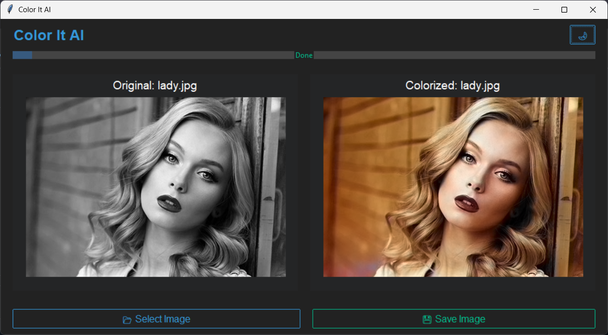

# 🖼️ Color It AI App

A modern desktop application to convert black & white images into high-quality, colorized images using OpenCV's deep learning-based Caffe model. The app features an intuitive GUI built with `ttkbootstrap`, supports drag-and-drop, zoom, dark/light themes, and more.

---

## 🚀 Features

- 🎨 **Automatic Image Colorization** using pretrained Caffe model.
- 🧲 **Drag and Drop Support** for fast loading of images.
- 🖥️ **Side-by-Side Comparison** of original and colorized images.
- 🌙 **Dark/Light Theme Toggle**.
- 💾 **Save Colorized Image** in JPG or PNG format.
- 🧊 **Splash Screen** with blurred background and loading spinner.

---

## 📸 Screenshot

Here is a preview of the Colorizer App in action:


---

## 🧠 Powered By

- `OpenCV` (Caffe-based colorization model)
- `NumPy`, `Pillow`
- `TkinterDnD2` for drag-and-drop
- `ttkbootstrap` for modern GUI styling

---

## 🗂️ Project Structure

```bash
📁 model/
  ├── colorization_deploy_v2.prototxt
  ├── colorization_release_v2.caffemodel
  └── pts_in_hull.npy

📁 app/
  └── Color It v0.9.py  # Main script

📁 assets/
  └── splash_bg.jpg  # Optional splash background

README.md
